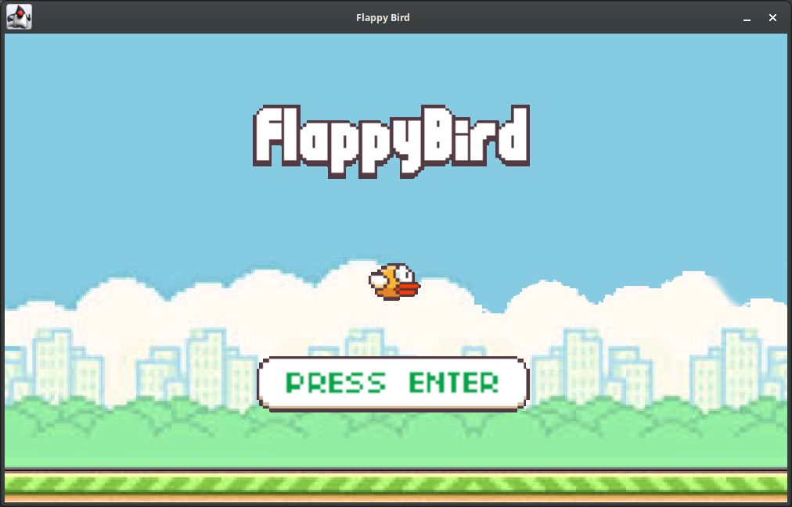
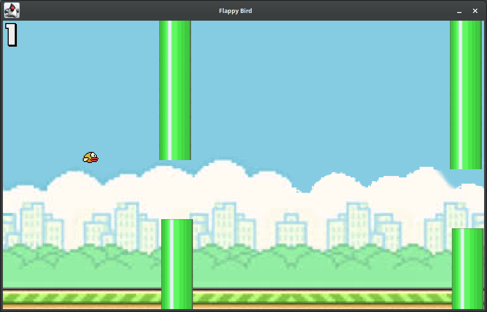
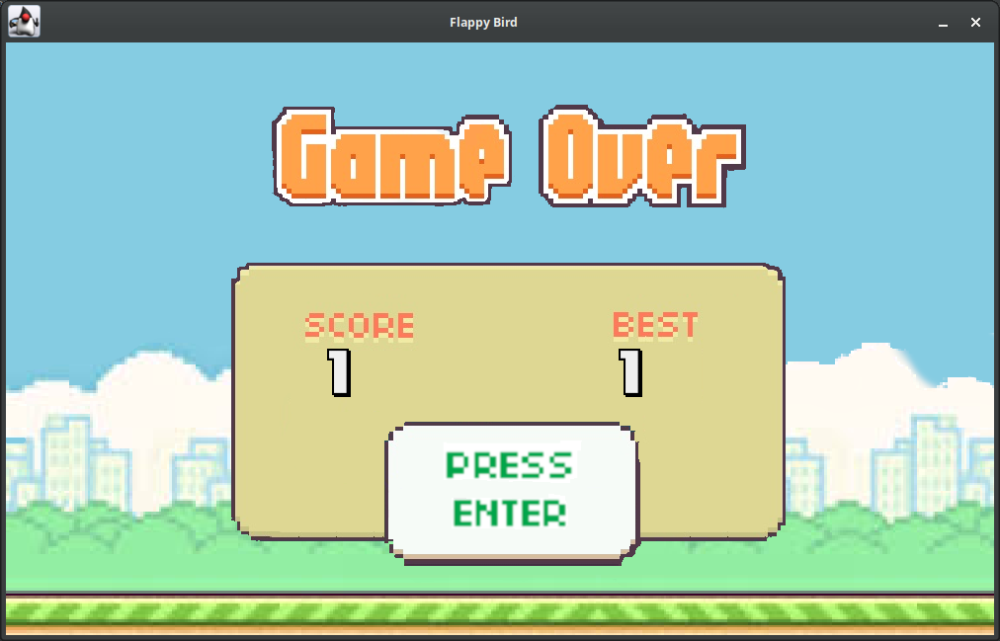

# Flappy Bird Game

Flappy Bird is a popular mobile game where the player controls a bird, navigating it through a series of pipes by tapping the screen to make the bird flap its wings.

This is a simple implementation of the popular Flappy Bird game using Java and the Swing graphics library. The game allows players to control a bird by pressing the space bar to make it flap its wings and navigate through a series of pipes.

#Features

- Simple and addictive gameplay inspired by the popular Flappy Bird game.

- <strong>Controls:</strong> Control the bird's flight by pressing the space bar.

- <strong>Randomly generated pipes:</strong> Each game session features a unique arrangement of pipes, providing a fresh challenge.

- <strong>Scoring system:</strong> Earn one point for successfully passing each pipe, and strive to achieve a high score.

- <strong>Game menu:</strong> Start the game, listen to the wonderful music, or quit the game.

- <strong>Game over screen:</strong> Displays the final score, a high score and offers an option to restart the game.

- <strong>Sound effects:</strong> Enjoy immersive sound effects for bird flapping, collisions, and scoring points.

- <strong>Customizable gameplay parameters:</strong> Modify window size, bird appearance, pipe appearance, gravity, and flap force to suit your preferences.

- <strong>Responsive and fluid graphics:</strong> The game utilizes the Swing graphics library to provide smooth and visually appealing animations.

- <strong>Compatible with Java 17:</strong> Developed using Java 17, ensuring compatibility with the latest Java version.

## Screenshots


*Main Menu*


*In Game*


*Game Over*

# Play

## Prerequisites

- Java Development Kit (JDK) 17

## Steps

1. Clone the repository to your local machine using the following command:
```
git clone https://github.com/rudransh-shrivastava/flappy-bird-game.git
```

### Using an IDE

1. Open your preferred Java IDE (Integrated Development Environment) such as IntelliJ IDEA, Eclipse, or NetBeans.

2. Run the `Main` class to start the game.

### Using Command Line

1. Open a terminal or command prompt.

2. Navigate to the project directory:
```
cd flappy-bird-game
```

3. Go to the `build/libs` folder:
```
cd build/libs
```

4. Run the game using the following command:
```
java -jar Flappy-Bird-1.0-SNAPSHOT.jar
```

### Objective

Use the space bar to control the bird. The objective is to navigate the bird through the gaps between the pipes without colliding with them. Each successful passage through a pipe earns one point. The game ends if the bird collides with a pipe or hits the ground.

## Contributing

Contributions to this project are welcome. If you find any issues or have suggestions for improvements, please open an issue or submit a pull request.

## License

This project is licensed under the [MIT License](LICENSE).

## Acknowledgments

The implementation of this Flappy Bird game was inspired by the original Flappy Bird game created by Dong Nguyen.
